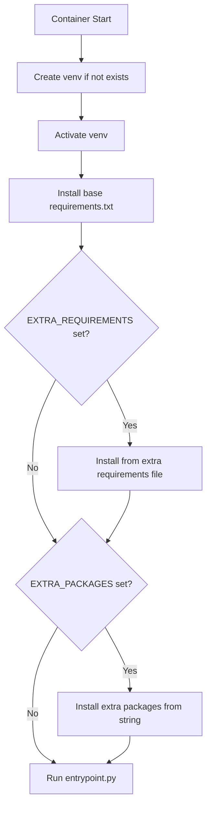

# Plan: Extra Package Installation Feature

## Problem Statement

Users with newer GPUs (e.g., RTX 5070) need newer PyTorch versions than the pinned `torch==2.2.0` in the author's [`styletts2-ukrainian/requirements.txt`](../styletts2-ukrainian/requirements.txt:9). Since this file is in a git submodule, it cannot be edited directly.

## Solution Overview

Add two **optional** environment variables to [`entrypoint.sh`](../entrypoint.sh) that allow users to install additional packages after the base requirements:

| Variable | Required? | Purpose | Use Case |
|----------|-----------|---------|----------|
| `EXTRA_REQUIREMENTS` | No (optional) | Path to a requirements file | Complex overrides with index URLs |
| `EXTRA_PACKAGES` | No (optional) | Space-separated package list | Simple package additions/overrides |

> **Note:** Both variables are completely optional. If neither is set, the container behaves exactly as before.

## Implementation Details

### 1. Modified [`entrypoint.sh`](../entrypoint.sh)

```bash
#!/usr/bin/env bash
set -e

if [[ ! -d "$UV_PROJECT_ENVIRONMENT" ]]; then
  uv venv $UV_PROJECT_ENVIRONMENT
fi
source $UV_PROJECT_ENVIRONMENT/bin/activate

cd $APP_DIR
uv pip install -r requirements.txt

# Install extra requirements from file if specified and file exists
if [[ -n "${EXTRA_REQUIREMENTS}" ]]; then
  if [[ -f "${EXTRA_REQUIREMENTS}" ]]; then
    echo "Installing extra requirements from ${EXTRA_REQUIREMENTS}..."
    uv pip install -r "${EXTRA_REQUIREMENTS}"
  else
    echo "WARNING: EXTRA_REQUIREMENTS file not found: ${EXTRA_REQUIREMENTS} - skipping"
  fi
fi

# Install extra packages if specified
if [[ -n "${EXTRA_PACKAGES}" ]]; then
  echo "Installing extra packages: ${EXTRA_PACKAGES}"
  uv pip install ${EXTRA_PACKAGES}
fi

uv run --no-config entrypoint.py
```

> **Error Handling:** If `EXTRA_REQUIREMENTS` is set but the file doesn't exist, a warning is printed and the step is skipped (not a fatal error).

### 2. Documentation Updates for [`README.md`](../README.md)

Add a new section:

```markdown
### Overriding Packages (e.g., for newer GPUs)

If you need to override packages (like PyTorch for newer GPU support), you have two options:

#### Option 1: Using a requirements file (recommended for PyTorch)

1. Copy the example file:
   ```bash
   cp user_requirements.txt.example user_requirements.txt
   ```

2. Edit `user_requirements.txt` to your needs (uncomment the appropriate section)

3. Run the container:
   ```bash
   docker run \
     -v $(pwd)/user_requirements.txt:/app/user_requirements.txt \
     -e EXTRA_REQUIREMENTS=/app/user_requirements.txt \
     -p 7860:7860 \
     ghcr.io/alertua/patriotyk_styletts2_ukrainian_docker:latest
   ```

#### Option 2: Using environment variable (simple packages only)

```bash
docker run \
  -e EXTRA_PACKAGES="numpy==1.26.0 some-other-package" \
  -p 7860:7860 \
  ghcr.io/alertua/patriotyk_styletts2_ukrainian_docker:latest
```

> **Note:** For PyTorch with custom index URLs, use Option 1 (requirements file) as it properly supports the `--index-url` directive.

#### RTX 5070 Example

RTX 5070 (Blackwell architecture) requires PyTorch 2.5+ with CUDA 12.4:

1. Create `user_requirements.txt`:
   ```txt
   --index-url https://download.pytorch.org/whl/cu124
   torch==2.5.1
   torchvision
   torchaudio
   ```

2. Run with GPU support:
   ```bash
   docker run --gpus all \
     -v $(pwd)/user_requirements.txt:/app/user_requirements.txt \
     -e EXTRA_REQUIREMENTS=/app/user_requirements.txt \
     -p 7860:7860 \
     ghcr.io/alertua/patriotyk_styletts2_ukrainian_docker:latest
   ```

See [`user_requirements.txt.example`](user_requirements.txt.example) for more examples.
```

## Workflow Diagram



## Files to Modify

1. **[`entrypoint.sh`](../entrypoint.sh)** - Add the extra package installation logic with error handling
2. **[`user_requirements.txt.example`](../user_requirements.txt.example)** - New example file with commented examples
3. **[`README.md`](../README.md)** - Add documentation section

## New File: `user_requirements.txt.example`

```txt
# Example user_requirements.txt for overriding packages
# Copy this file and modify as needed
#
# Usage:
#   docker run \
#     -v $(pwd)/user_requirements.txt:/app/user_requirements.txt \
#     -e EXTRA_REQUIREMENTS=/app/user_requirements.txt \
#     ...
#
# For RTX 5070 (Blackwell architecture), use PyTorch 2.5+ with CUDA 12.4:
# --index-url https://download.pytorch.org/whl/cu124
# torch==2.5.1
# torchvision
# torchaudio
#
# For RTX 4090 (Ada Lovelace architecture), CUDA 12.1 is recommended:
# --index-url https://download.pytorch.org/whl/cu121
# torch==2.5.1
# torchvision
# torchaudio
#
# For CPU-only installation:
# --index-url https://download.pytorch.org/whl/cpu
# torch==2.5.1
# torchvision
# torchaudio
```

## RTX 5070 Detailed Example

### Background

RTX 5070 uses NVIDIA's new Blackwell architecture and requires:
- CUDA 12.4+ compatible PyTorch
- PyTorch 2.5.0+ for full support

The original `torch==2.2.0` does not support RTX 5070.

### Step-by-Step Guide for RTX 5070 Users

#### Step 1: Create `user_requirements.txt`

Create a file named `user_requirements.txt` on your host machine:

```txt
--index-url https://download.pytorch.org/whl/cu124
torch==2.5.1
torchvision
torchaudio
```

> **Why cu124?** RTX 5070 requires CUDA 12.4. The PyTorch wheel index `cu124` contains CUDA 12.4 compiled wheels.

#### Step 2: Run the Container

```bash
docker run --gpus all \
  -v $(pwd)/user_requirements.txt:/app/user_requirements.txt \
  -e EXTRA_REQUIREMENTS=/app/user_requirements.txt \
  -p 7860:7860 \
  ghcr.io/alertua/patriotyk_styletts2_ukrainian_docker:latest
```

#### Alternative: Using docker-compose

Add to your `docker-compose.yml`:

```yaml
services:
  styletts2:
    image: ghcr.io/alertua/patriotyk_styletts2_ukrainian_docker:latest
    environment:
      - EXTRA_REQUIREMENTS=/app/user_requirements.txt
    volumes:
      - ./user_requirements.txt:/app/user_requirements.txt
    ports:
      - "7860:7860"
    deploy:
      resources:
        reservations:
          devices:
            - driver: nvidia
              count: all
              capabilities: [gpu]
```

### What Happens During Startup

1. Container creates venv in `/data/venv`
2. Base requirements installed (torch==2.2.0)
3. **Extra requirements installed** (torch==2.5.1 **overrides** 2.2.0)
4. Application starts with newer PyTorch

### Verifying the Installation

Check logs during startup for:
```
Installing extra requirements from /app/user_requirements.txt...
```

You can also exec into the container and verify:
```bash
docker exec -it <container_id> bash
source /data/venv/bin/activate
python -c "import torch; print(torch.__version__); print(torch.cuda.is_available())"
```

Expected output:
```
2.5.1
True
```

## Notes

- The `EXTRA_PACKAGES` variable uses space-separated values, which works for simple package names
- For PyTorch with custom wheel indexes, use `EXTRA_REQUIREMENTS` with a file that includes `--index-url`
- The extra packages are installed AFTER base requirements, so they will override versions
- Both `EXTRA_REQUIREMENTS` and `EXTRA_PACKAGES` are **optional** - if not set, the container works as before
